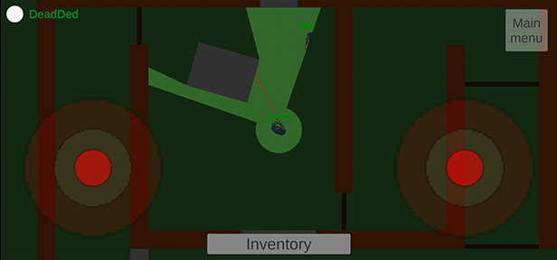
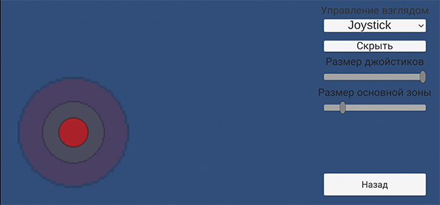
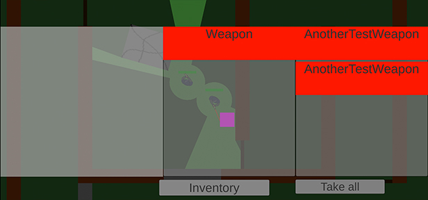

# Мобильный top-down shooter

Ссылка на акуальный APK-файл - [тык](https://drive.google.com/file/d/1FxwjD6GzfROJEZxML4ch37pGrNrCSTbx/view)

Собрались как-то программисты свою игру создавать, а дизайнера нет...
## Список фичей

- Лазерные прицелы
- Ограничение обзора видимости
- Различные виды объектов:
  - Разрушаемые
  - Неразрушаемые
  - Двери
- Движение в 2 режимах - ходьба + бег (регулируется отклонением джойстика до нужной зоны)

- 2 режима управления стрельбой:
  - джойстик с 2 уровнями - направление взгляда и стрельба
  - прицеливание удержанием пальца и кнопка вкл/выкл стрельбы
- Возможность настройки размера джойстика и второй зоны

- Можно рекрутировать нейтральных персонажей и переключаться между союзными

- Есть простецкий функционал инвентаря

